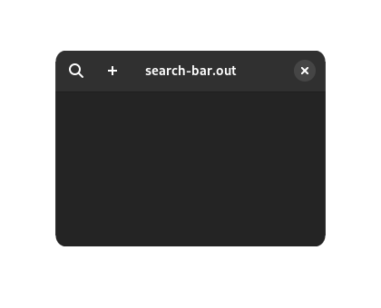
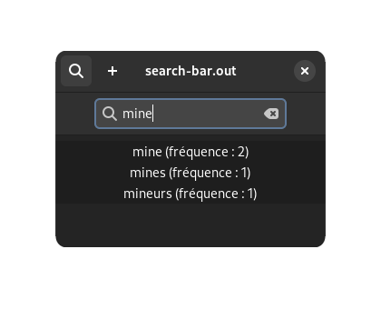
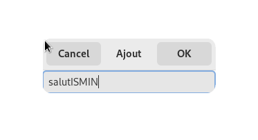
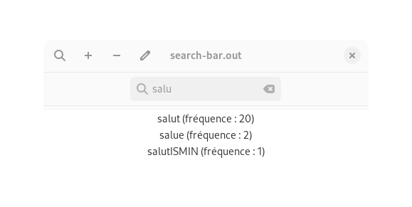
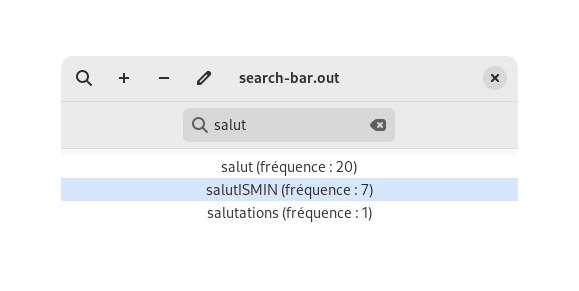
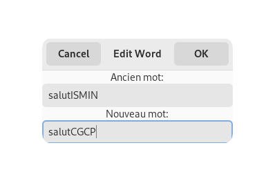
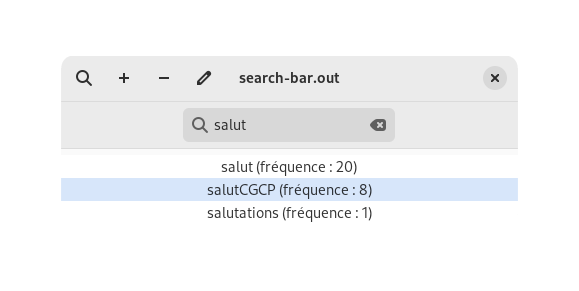
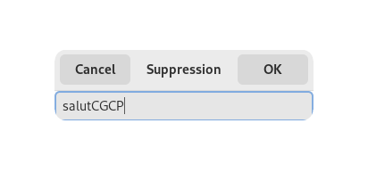
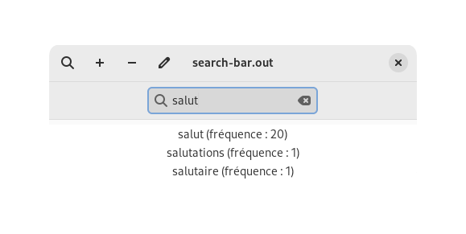

# algo-prog-projet-2

## Algorithme et Programmation II

### Fichiers fournis :

* gui.\* : Code contenant l'interface graphique

* hash.\* : Code contenant toutes les fonctions qui gèrent la table de hachage

* text.* : Quelques fonctions qui modifie le texte entré, pour qu'il y ait le moins d'erreur possible.

* mots_courants.txt : Sert de dictionnaire de prédiction.

* francais.txt : Dictionnaire de français, permettant de suggerer des mots s'il y en n'a pas de compatible dans mots_courants.txt.


## Installation
1. installer les dépendances GTK4 ([documentation officielle](https://www.gtk.org/docs/installations/)) :

* Fedora :

```
sudo dnf install gtk4-devel
```

* Ubuntu/Debian :

```
sudo apt install libgtk-4-dev
```

* Arch :

```
sudo pacman -S gtk4
```

Pour Windows et MacOS, voir la [documentation](https://www.gtk.org/docs/installations/). Nous n'avons pas essayé de compiler sur ces OS. Nous ne savons pas si le make et ses flags vont fonctionner.

2. Si ce n'est pas déjà fait, cloner le dépôt :
```
git clone https://gitlab.emse.fr/lucien.gheerbrant/algo-prog-projet-2.git
```

3. Compiler le code depuis sa source : 
```
cd algo-prog-projet-2
make
```

4. Exécuter le code : 
```
./search-bar.out
```

## Utilisation



Commencez à taper directement ou cliquez sur le bouton avec l'icône loupe pour rechercher un mot.



Cliquez sur le bouton avec l'icône ➕ pour ajouter un mot. Appuyez sur 'OK' Pour confirmer.



Rafraîchissez la fenêtre en tapant n'importe quelle lettre. Le mot apparaîtra.



Pour modifier la fréquence d'un mot, il suffit de cliquer dessus. L'affichage se mettra à jour en tapant n'importe quelle lettre.



Pour éditer un mot, appuyez sur l'icône crayon.



Le nouveau mot remplacera l'ancien mot, en gardant sa fréquence.



Cliquez sur le bouton avec l'icône ➖ pour supprimer un mot. Appuyez sur 'OK' Pour confirmer.



Mettez à jour la fenêtre : le mot a disparu !


