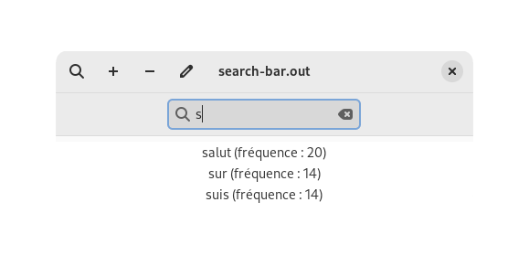

# algo-prog-projet-2

## Algorithme et Programmation II
### Projet : Saisie Intuitive

La saisie intuitive ou prédictive (de l’anglais predictive text) est une
technologie conçue afin de faciliter la frappe de texte sur les claviers
téléphoniques ou tablettes. Un exemple éloquent d’une telle technologie est le
T9, abréviation de text on 9 keys.

Développer une application capable de supporter les deux options classiques de
la saisie prédictive: (i) la saisie automatique, et (ii) l’acquisition de mots.


### Interface graphique

L'UI a été faite avec GTK4 (de la fondation GNOME) et leur librairie C.

J'ai (Lucien) toujours voulu essayé de faire une application GTK, donc j'ai sauté sur l'occasion.

## Installation
1. installer les dépendances GTK4 ([documentation officielle](https://www.gtk.org/docs/installations/)) :
	* Fedora :
```sh
sudo dnf install gtk4-devel
```

	* Ubuntu/Debian :
```sh
sudo apt install libgtk-4-dev
```

	* Arch :
```sh
sudo pacman -S gtk4
```

Pour Windows et MacOS, voir la [documentation](https://www.gtk.org/docs/installations/). Nous n'avons pas essayé de compiler sur ces OS. Nous ne savons pas si le make et ses flags vont fonctionner.

2. Cloner le dépôt :
```sh
git clone https://gitlab.emse.fr/lucien.gheerbrant/algo-prog-projet-2.git
```

3. Compiler le code depuis sa source : 
```sh
make
```

4. Exécuter le code : 
```sh
./search-bar.out
```

## Utilisation


Commencez à taper directement ou cliquez sur le bouton avec l'icône loupe pour rechercher un mot.



Cliquez sur un des trois mots pour augmenter sa fréquence (il faut retaper le mot pour voir le chiffre fréquence monter).

Cliquez sur le bouton avec l'icône ➕ pour ajouter un mot. Appuyez sur 'OK' Pour confirmer.


Redémarrer le programme et le nouveau mot apparaîtra.


## Fonctionnement

Le dictionnaire complet et le dictionnaire local (mots_courants.txt) sont chargés dans une table de hachage.

A chaque mot est associé une variable fréquence frq.

A chaque fois qu'on essaie d'ajouter un mot dans la table, on regarde s'il n'est pas déjà dedans. S'il ne l'est pas, on l'ajoute avec une fréquence de 1. Sinon on incrémente cette fréquence.

Les mots qui ne sont pas dans le dictionnaire local ont donc une fréquence de 1. Ceux qui le sont ont une fréquence d'au moins 2 (On peut alors les différencier comme ça).

Lorsque l'on tape des lettres dans la barre de recherche, que l'on associe sous forme de préfixe, on regarde s'il y a des mots avec ce même préfixe (avec un strcomp sur le début du mot) dans la table en la parcourant entièrement: Ce sont des suggestions. On ne garde que 3 suggestions, qui sont celles avec les plus grandes fréquences.

Si on clique sur une suggestion, on augmente sa fréquence et on le rajoute à la fin du dictionnaire local, pour augmenter sa fréquence lorsque l'application est relancée une autre fois.

De même, lorsqu'on rajoute un mot, on le place à la fin du dictionnaire local.